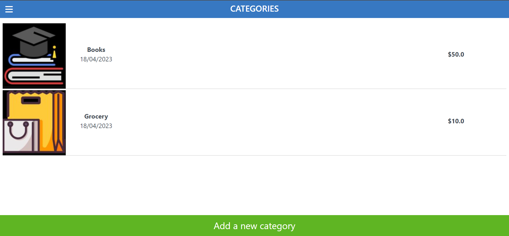

# Budget app

> The project is a website that you can create budget categories in it and the transactions for those categories.

## Built With

- HTML & CSS
- JavaScript
- Ruby on Rails
- Rspec
- OOP

## Video
[video](https://www.loom.com/share/c47407c2c69d4167944988a311e6503c)

## Getting Started

To get a local copy up and running follow these simple example steps.

- copy this link `https://github.com/ShahierNashaat/budget-app.git`.
- get the directory that you want to clone the repository.
- open the command prompt in this directory.
- write `git clone https://github.com/ShahierNashaat/budget-app.git`.
- go to the repository folder in your command prompt.
- run `bundle install`.
- run `npm install`
- To create database run `rails db:create`
- run `rails db:migrate`
- To run the test run `rspec` in your command prompt.

## Author

👤 **Shahier Nashaat**

- GitHub: [@githubhandle](https://github.com/ShahierNashaat)
- Twitter: [@twitterhandle](https://twitter.com/ShahierN)
- LinkedIn: [LinkedIn](https://www.linkedin.com/in/shahier-nashaat-73519313a/)

## 🤝 Contributing

Contributions, issues, and feature requests are welcome!

Feel free to check the [issues page](../../issues/).

## Show your support

Give a ⭐️ if you like this project!

## Acknowledgments

- Got inspired by [Gregoire Vella on Behance](https://www.behance.net/gregoirevella).

## 📝 License

This project is [MIT](./MIT.md) licensed.